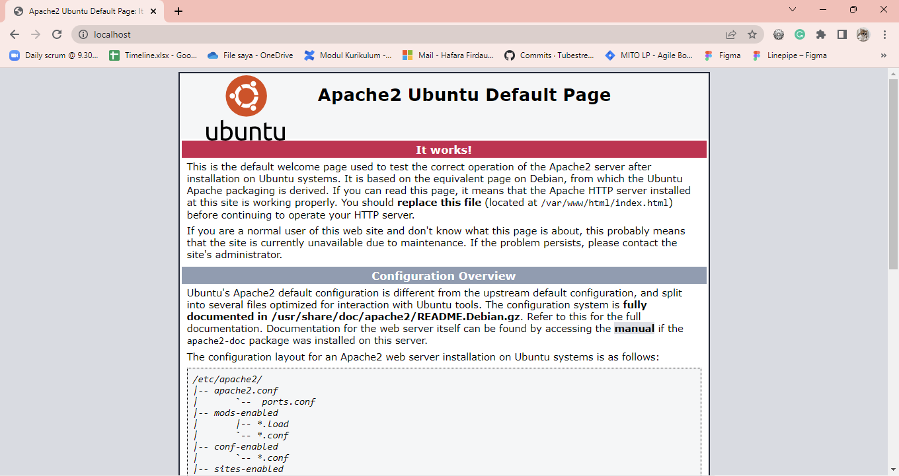
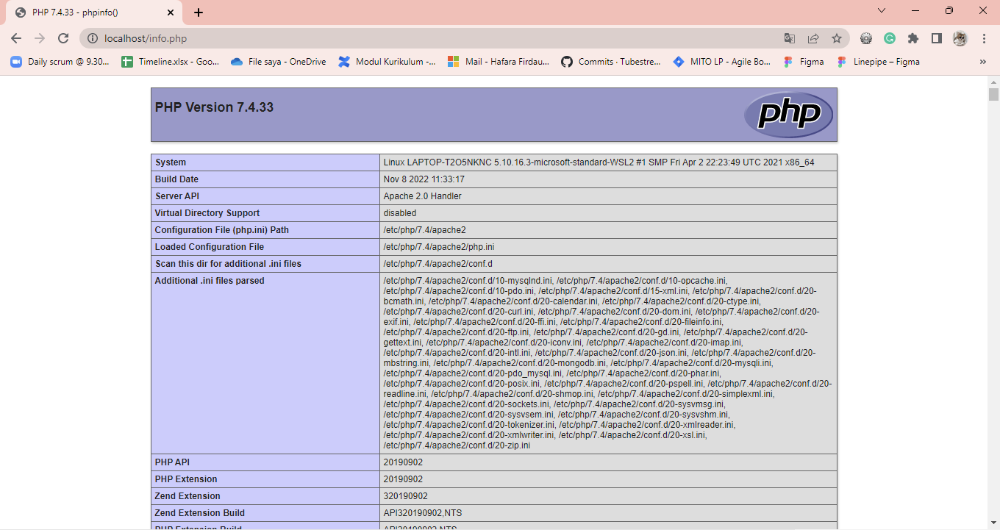
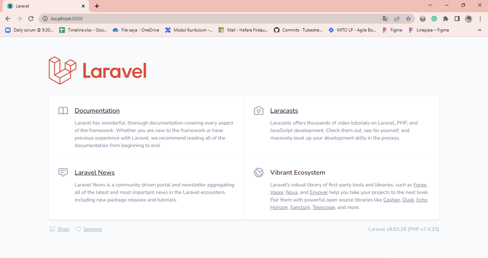
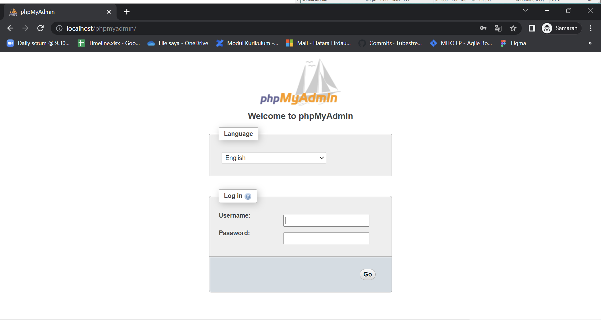
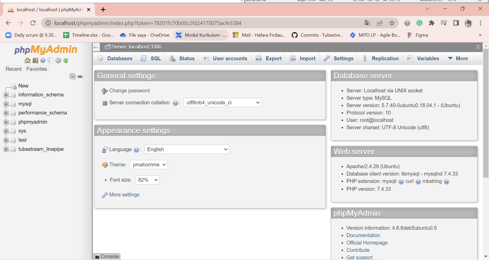
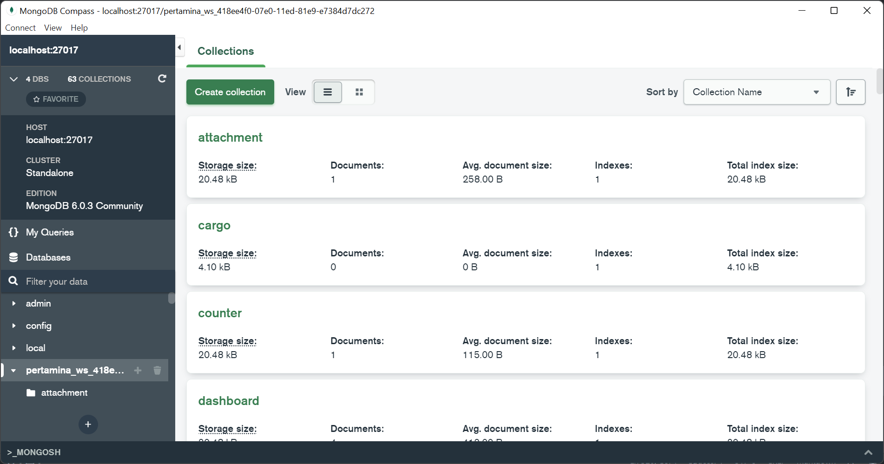
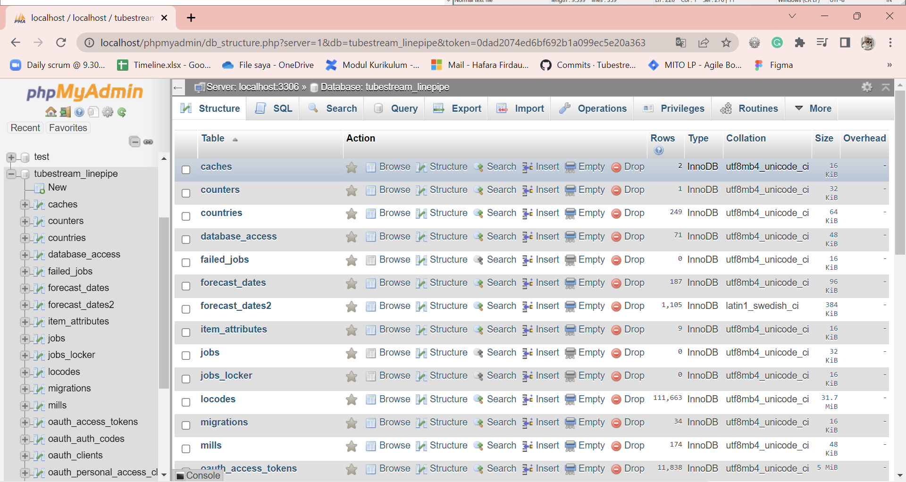
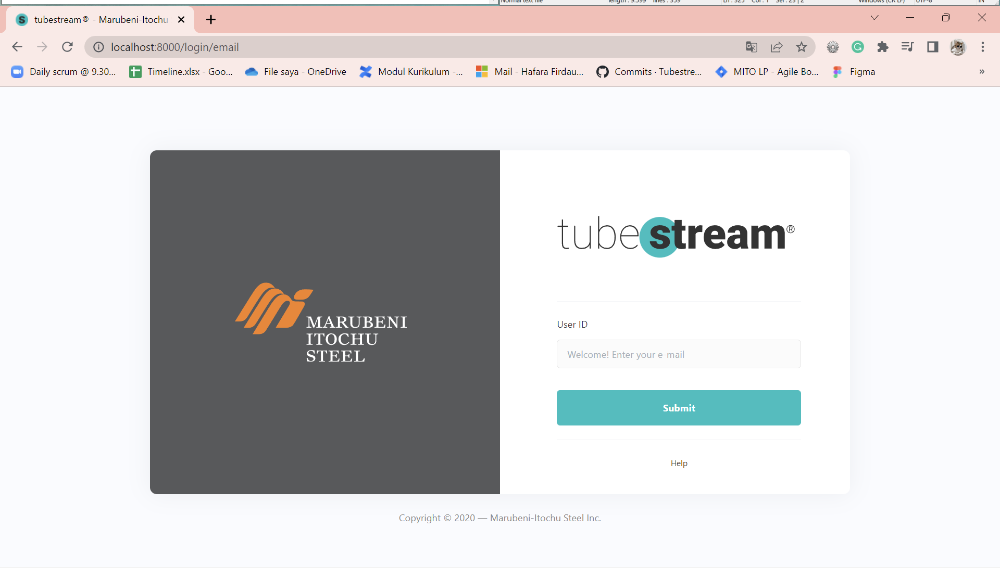

# Develop LAMP + MLVN Stack in Windows Subsystem for Linux (WSL) Ubuntu 18.04

A documentation of **Linepipe Tubestream** web deployment on local.

```
by: mocatfrio (hafarafirdausi@gmail.com)
```

Requirements:
* PHP 7.4.1
* Node v12.14.1
* Laravel 8

Environment: 
* Windows Subsystem for Linux (WSL)
* Ubuntu 18.04.6 LTS

## Installation

LAMP stands for Linux, Apache, MySQL, and PHP. While, MLVN stands for MongoDB, Laravel, VueJS, and NodeJS, Lol :) 

What to install:
* Apache2
* PHP 7.4
* Composer and Laravel
* MySQL and PhpMyAdmin
* MongoDB and MongoDBCompass / Robo3T
* NodeJS and NPM

Preparation:

```bash
# Update
sudo apt update

# Upgrade the packages
sudo apt upgrade

# Install basic needs?
sudo apt install -y git curl wget zip unzip
```

### Apache2

1. Install Apache2

    ```bash
    sudo apt install apache2
    ```

2. Check service status and start the service

    ```bash
    sudo service apache2 start
    sudo service apache2 status
    ```

3. Adjust the firewall to allow web traffic

    ```bash
    sudo ufw allow in "Apache Full"
    ```

4. Enable mod_rewrite

    ```bash
    sudo a2enmod rewrite
    sudo service apache2 restart
    ```

5. Test

    


### PHP 7.4

1. Install PHP 7.4

    ```bash
    sudo apt -y install software-properties-common
    
    # Add repo 
    sudo add-apt-repository ppa:ondrej/php
    sudo apt update

    # Install PHP
    sudo apt install -y php7.4 php7.4-fpm php7.4-mongodb php7.4-mysql php7.4-xml php7.4-gd php7.4-curl php7.4-cli php7.4-mbstring php7.4-pspell php7.4-zip php7.4-json php7.4-common php7.4-bcmath php7.4-intl php7.4-imap 
    ```

2. Set web server to prioritize the php file first

    ```bash 
    sudo nano /etc/apache2/mods-enabled/dir.conf
    # Then, make index.php become first order/priority
    ```

3. Test
   
    ```bash
    sudo nano /var/www/html/info.php
    ```
    Add this:

    ```php
    <?php
    phpinfo();
    ?>
    ```

    


### Composer and Laravel

1. Install Composer 

    ```bash
    php -r "copy('https://getcomposer.org/installer', 'composer-setup.php');"
    php -r "if (hash_file('sha384', 'composer-setup.php') === '55ce33d7678c5a611085589f1f3ddf8b3c52d662cd01d4ba75c0ee0459970c2200a51f492d557530c71c15d8dba01eae') { echo 'Installer verified'; } else { echo 'Installer corrupt'; unlink('composer-setup.php'); } echo PHP_EOL;"
    php composer-setup.php
    php -r "unlink('composer-setup.php');"
    sudo mv composer.phar /usr/local/bin/composer
    ```

    If there is error related to the symlink (?)

    ```bash
    cp /usr/local/bin/composer /usr/bin/
    ```

2. Test

    ```bash
    # Create an example project 
    composer create-project --prefer-dist laravel/laravel example

    cd example
    php artisan serve
    ```   

    


### MySQL

1. Install MySQL

    ```bash
    sudo apt install mysql-server
    ```

2. Check service status and start the service

    ```bash
    sudo service mysql start
    sudo service mysql status
    ```

3. Add password to MySQL

    ```bash
    sudo mysql_secure_installation
    # Then follow the steps
    ```

    If there is error during installation, do this steps.

    ```bash
    # Kill first
    sudo killall -9 mysql_secure_installation

    # Enter mysql shell
    sudo mysql
    ``` 
    ```sql
    -- Edit password of root
    ALTER USER 'root'@'localhost' IDENTIFIED WITH mysql_native_password BY 'password';
    exit
    ```
    ```bash
    # Re-set mysql_secure_installation
    sudo mysql_secure_installation
    # password: password
    # Then, follow the steps
    ```

4. Test
    ```bash
    sudo mysql -u root -p 
    ```

To simplify database management, we need to install GUI for MySQL, in this case we use PhpMyAdmin.

5. Install PhpMyAdmin

    ```bash
    sudo apt install phpmyadmin php-gettext
    # Follow the installation

    # Restart apache2 service
    sudo service apache2 restart
    ```

6. Fix issue 1 - URL /phpmyadmin was not found on this server

    ```bash
    sudo nano /etc/apache2/apache2.conf
    # Add "Include /etc/phpmyadmin/apache.conf" in the end of file 
    ```

7. Test and it can be accessed well:)
 
    

8. Fix issue 2 - Access denied for user ‘root’@‘localhost’

    ```bash
    sudo mysql -u root -p
    ```
    ```sql
    SELECT User, Host, plugin FROM mysql.user;
    ALTER USER 'root'@'localhost' IDENTIFIED WITH mysql_native_password BY 'password';
    ```

9. Test again and now i can login:)

    

10. Fix issue 3 - Cant export database via phpmyadmin

    ```bash
    sudo nano /usr/share/phpmyadmin/libraries/plugin_interface.lib.php

    # Edit 
    # From: if ($options != null && count($options) > 0) {
    # To: if ($options != null && count((array)$options) > 0) {

    sudo service apache2 restart
    sudo nano /usr/share/phpmyadmin/libraries/sql.lib.php

    # Edit
    # From: && ((empty($analyzed_sql_results['select_expr']))
    #            || (count($analyzed_sql_results['select_expr'] == 1)
    #                && ($analyzed_sql_results['select_expr'][0] == '*')))
    # To:  && ((empty($analyzed_sql_results['select_expr']))
    #            || (count($analyzed_sql_results['select_expr']) == 1)
    #                && ($analyzed_sql_results['select_expr'][0] == '*'))
    ```

11. Create User and Grant all privileges

    ```bash
    sudo mysql -u root -p
    ```
    ```sql
    CREATE USER 'mocatfrio'@'localhost' IDENTIFIED WITH mysql_native_password BY '*******';
    GRANT ALL PRIVILEGES ON *.* TO 'mocatfrio'@'localhost' WITH GRANT OPTION;
    FLUSH PRIVILEGES;
    ```

12. Test new user

    ```bash
    sudo mysql -u mocatfrio -p
    ```

### MongoDB

I got stuck and had trouble installing docker on WSL because of a "systemctl" issue.

``` bash
> sudo systemctl start mongod
System has not been booted with systemd as init system (PID 1). Cant operate.
Failed to connect to bus: Host is down
``` 
Then, I got another option from [here](https://askubuntu.com/questions/1379425/), which is to use Docker to provide MongoDB services. However, Fu said *"Why Docker? it's too heavy for just a mongo"*. Okay I'll try again, next time, without Docker.

1. Install Docker

    ```bash
    sudo apt install apt-transport-https ca-certificates curl software-properties-common

    curl -fsSL https://download.docker.com/linux/ubuntu/gpg | sudo apt-key add -\
    sudo add-apt-repository "deb [arch=amd64] https://download.docker.com/linux/ubuntu bionic stable"
    sudo apt update

    apt-cache policy docker-ce
    sudo apt install docker-ce
    ```

2. Check service status and start the service

    ```bash
    sudo service docker start
    sudo service docker status
    ```

3. Executing docker without sudo

    ```bash
    sudo usermod -aG docker mocatfrio
    su - mocatfrio 
    ```

4. Test the docker

    ```bash
    $ docker run hello-world

    $ docker images
    REPOSITORY    TAG       IMAGE ID       CREATED         SIZE
    mongo         latest    2dd27bb6d3e6   2 days ago      695MB
    hello-world   latest    feb5d9fea6a5   14 months ago   13.3kB
    ```

5. Install MongoDB in Docker

    ```bash
    docker pull mongo 
    docker run --name mongo_example -d mongo
    ```

6. Test again:)
   
    ```bash
    $ docker ps
    CONTAINER ID   IMAGE     COMMAND                  CREATED        STATUS        PORTS                                                                              NAMES
    eb04b9d148eb   mongo     "docker-entrypoint.s…"   11 hours ago   Up 11 hours   0.0.0.0:90->90/tcp, :::90->90/tcp, 0.0.0.0:27017->27017/tcp, :::27017->27017/tcp   mongo_dev
    ```

    ```bash
    # Enter to the docker 
    docker exec -it mongo_example bash

    # Enter to mongo shell
    mongosh
    > show dbs
    ```

7. Mounting host system directory in MongoDB docker container

    ```bash
    # Make local data directory
    cd ~
    mkdir mongodb_data_directory/

    # Docker run with port and host system directory
    docker run -it -p 90:90 -p 27017:27017 -v ~/mongodb_data_directory:/data/db --name mongo_dev -d mongo
    ```

8. Test

    Install MongoDB GUI in Windows, such as MongoDB Compass or Robo3T. Then try to connect  to `mongodb://localhost:27017`.

    

### NodeJS + NPM in WSL

1. Install NVM (Node Version Manager)

    ```bash
    sudo apt install curl
    curl -o- https://raw.githubusercontent.com/nvm-sh/nvm/master/install.sh | bash

    # Check
    command -v nvm
    nvm ls
    ```
2. Install a specific version of NodeJS and NPM

    ```bash
    nvm install 12

    # Check
    node -v
    npm -v
    ```

## Preparation 

This web application uses two kinds of databases to store data, i.e. MySQL and MongoDB. MySQL is used to store global data, while MongoDB is used to store each project's data. 

Hence, before deploying, we need to import the database dump first. 

### Import data to MySQL

1. Create DB

    ```bash
    mysql -u mocatfrio -p 
    ```
    ```sql
    sql> create database tubestream_linepipe;
    ```

2. Import database

    Because of the SQL dump has more than one file, I merged them into one first.

    ```bash
    # Merge
    cat *.sql  > all_files.sql

    # Import
    sudo mysql -u mocatfrio -p tubestream_linepipe < all_files.sql
    ```

3. Check 

    

    Check via SQL CLI:

    ```sql
    mysql> show databases;
    +---------------------+
    | Database            |
    +---------------------+
    | information_schema  |
    | mysql               |
    | performance_schema  |
    | phpmyadmin          |
    | sys                 |
    | test                |
    | tubestream_linepipe |
    +---------------------+
    7 rows in set (0.00 sec)

    mysql> use tubestream_linepipe;
    Reading table information for completion of table and column names
    You can turn off this feature to get a quicker startup with -A

    Database changed

    mysql> show tables;
    +-------------------------------+
    | Tables_in_tubestream_linepipe |
    +-------------------------------+
    | caches                        |
    | counters                      |
    | countries                     |
    | database_access               |
    | failed_jobs                   |
    | forecast_dates                |
    | ...                           |
    | users                         |
    +-------------------------------+
    26 rows in set (0.01 sec)

    ```

### Import data to MongoDB

1. Enter to the docker

    ```bash
    docker exec -it mongo_dev bash
    ```

2. Import database

    ```bash
    mongorestore --db pertamina_ws_418ee4f0-07e0-11ed-81e9-e7384d7dc272 pertamina_ws_418ee4f0-07e0-11ed-81e9-e7384d7dc272/
    ```

2. Check

    


## Deployment

In short, here are the steps of web deployment:
1. Clone project
2. Edit .env file
3. Composer install
4. NPM install
5. Done!

### Clone Project

1. Generate SSH key
    ```bash
    ssh-keygen -t rsa -b 4096 -C "hafarafirdausi@gmail.com"
    ```

2. Adding it to the ssh-agent

    ```bash
    eval "$(ssh-agent -s)"
    ssh-add ~/.ssh/id_rsa
    ```

3. Add SSH key to Github 
   * Open **github.com**
   * Open **Settings**
   * Open **SSH dan GPG keys**
   * Copy ~/.ssh/id_rsa.pub

        ```bash
        cat ~/.ssh/id_rsa.pub
        ```

   * Click **New SSH Key**
   * Paste the copied SSH key

4. Clone project with SSH
   
    ```bash
    # Clone with SSH
    sudo git clone git@github.com:Tubestream/mcms-lp.git

    # If re-set url git remote
    git remote set-url origin git@github.com:Tubestream/mcms-lp.git

    cd mcms-lp

    # Move to active branch
    git checkout 13.0
    ```

5. Set directory permission
   
    ```bash
    cd ..
    sudo chown -R mocatfrio mcms-lp/
    sudo chmod -R 755 mcms-lp/

    cd mcms-lp
    sudo chmod -R 777 storage/
    ```

6. Git command
    
    ```bash
    # Pull codes
    git pull origin
    
    # Set global config before pushing
    git config --global user.email "hafarafirdausi@gmail.com"
    git config --global user.name "mocatfrio"

    # Push codes
    git push origin
    ```

### Edit .env file

1. Copy template
    ```bash
    cp .env.template .env
    ```

2. Edit .env
    ```bash
    # Edit
    SCRIPT_PATH=/var/www/html/mcms-lp/scripts/
    FILE_PATH=/var/www/html/mcms-lp/storage/app/
    MONGO_DB_PATH=/home/mocatfrio/mongodb_data_directory

    MYSQL_DB_HOST=127.0.0.1
    MYSQL_DB_PORT=3306
    MYSQL_DB_DATABASE=tubestream_linepipe
    MYSQL_DB_USERNAME=mocatfrio
    MYSQL_DB_PASSWORD=*****

    TEST_EMAIL=hafara@inosoftweb.com
    ```

### Composer Install 

1. Install packages
    ```bash
    composer install

    # Generate keys
    php artisan key:generate
    ```

2. Fix issue - oauth-public.key does not exist 
    
    ```bash
    Key path "file:///var/www/html/mcms-lp/storage/oauth-public.key" does not exist or is not readable
    ```

    * Make new Laravel project 
        ```bash 
        sudo composer create-project --prefer-dist laravel/laravel example
        sudo chown -R mocatfrio example
        sudo chmod -R 755 example
        cd example
        php artisan key:generate
        ```

    * Edit the .env of new project
        ```bash
        nano .env
        
        # Edit
        DB_DATABASE=test
        DB_USERNAME=root
        DB_PASSWORD=password
        ```

    * Install passport

        ```bash
        composer require laravel/passport

        nano config/app.php
        # Add this in the end of providers "Laravel\Passport\PassportServiceProvider::class,"

        php artisan migrate
        php artisan passport:install
        ```
        
    * Copy the generated key to the original project
  
        ```bash
        cd storage/
        cp *.key /var/www/html/mcms-lp/storage/
        ```

    * Generate key again

        ```bash
        cd /var/www/html/mcms-lp/storage/
        php artisan key:generate
        ```

### NPM Install

```bash
nvm use 12
npm install
```

### Test

```bash
cd /var/www/html/mcms-lp/
php artisan serve
npm run watch
```



Done!


## Credits
Big thanks to:
* https://www.digitalocean.com/community/tutorials/how-to-install-the-apache-web-server-on-ubuntu-18-04
* https://www.digitalocean.com/community/tutorials/how-to-install-linux-apache-mysql-php-lamp-stack-ubuntu-18-04
* https://www.serverlab.ca/tutorials/linux/administration-linux/how-to-install-php-7-4-on-ubuntu-18-04/
* https://getcomposer.org/download/
* https://panjeh.medium.com/install-phpmyadmin-on-ubuntu-18-04-with-php-7-2-and-lamp-stack-3c72e77eef33
* https://askubuntu.com/questions/1203689/cannot-start-mongodb-on-wsl
* https://askubuntu.com/questions/1379425/
* https://stackoverflow.com/questions/62495999/installing-mongodb-in-wslsystem-has-not-been-booted-with-systemd-as-init-system-pid-1-cant-operate
* https://www.digitalocean.com/community/tutorials/how-to-install-and-use-docker-on-ubuntu-18-04
* https://www.linode.com/docs/guides/set-up-mongodb-on-docker/
* https://stackoverflow.com/questions/37644465/how-to-connect-to-mongodb-running-in-docker-container
* https://learn.microsoft.com/en-us/windows/dev-environment/javascript/nodejs-on-wsl
  
```
Also much thanks and looove for Fu <3
```
